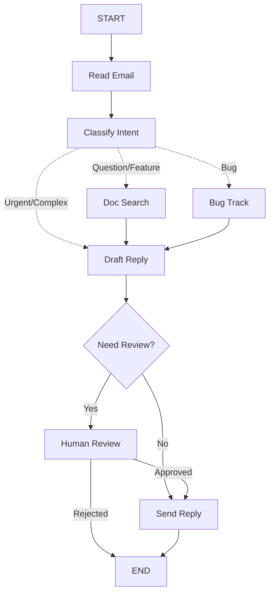

# LangGraph 实战笔记：构建基于状态机的智能客户支持 Agent

> **Author:** Jintao  
> **Tags:** #LangGraph #LLM #Agent #Python #SystemDesign  
> **Status:** Learning & Research

## 1. 项目背景与目标 (Introduction)

在 LLM 应用开发中，简单的线性链（Chains）往往无法处理复杂的业务逻辑。为了解决长流程、多决策点以及需要“人机回环”（Human-in-the-loop）的场景，我深入研究了 **LangGraph**。

本项目基于 LangGraph 构建了一个**智能客户支持 Agent**。与传统的问答 Bot 不同，该 Agent 具备以下能力：
*   **多意图分类**：自动识别邮件是咨询、Bug 报告还是紧急投诉。
*   **动态路由**：根据意图自动流转到不同的处理节点（搜索文档、提交工单、人工审核）。
*   **状态持久化**：支持中断和恢复，允许人工介入审核高风险回复。

## 2. 系统架构设计 (System Architecture)

在 LangGraph 中，核心思想是将 Agent 建模为**图（Graph）**。节点（Nodes）代表计算步骤，边（Edges）代表控制流，状态（State）在节点间传递。

### 2.1 工作流图 (Workflow)

我将整个处理流程拆解为以下离散节点：



### 2.2 核心节点定义

| 节点名称 | 功能描述 | 关键技术点 |
| :--- | :--- | :--- |
| **Classify Intent** | 分析邮件意图和紧急程度 | Structured Output (结构化输出) |
| **Doc Search** | 检索知识库 | RAG (检索增强生成) |
| **Bug Track** | 模拟提交 Bug 工单 | Tool Calling / API Integration |
| **Human Review** | 人工审核回复 | `interrupt` (中断机制) |

## 3. 状态管理 (State Design)

这是 LangGraph 与 LangChain 最本质的区别。所有的上下文都存储在一个共享的 `State` 中，而不是隐式传递。

**设计原则**：State 中只存储**原始数据 (Raw Data)**，而不是格式化后的 Prompt。Prompt 的组装应该在节点内部进行。

```python
from typing import TypedDict, Literal, List, Optional

# 定义邮件分类的结构
class EmailClassification(TypedDict):
    intent: Literal["question", "bug", "billing", "feature", "complex"]
    urgency: Literal["low", "medium", "high", "critical"]
    topic: str
    summary: str

# 定义全局状态
class EmailAgentState(TypedDict):
    # 1. 输入数据 (不可变)
    email_content: str
    sender_email: str
    email_id: str

    # 2. 中间推理结果 (由 LLM 生成)
    classification: Optional[EmailClassification]

    # 3. 外部数据 (由工具获取)
    search_results: Optional[List[str]]  # 存储原始文档片段
    customer_history: Optional[dict]     # CRM 数据

    # 4. 输出数据
    draft_response: Optional[str]
    messages: Optional[List[str]]
```

## 4. 核心代码实现 (Implementation)

以下是核心节点的实现逻辑。我使用了 LangGraph 的 `Command` 模式来显式控制流转，这种方式比条件边（Conditional Edges）更直观。

### 4.1 意图分类节点 (Classifier Node)

利用 LLM 的结构化输出能力，将非结构化的邮件转化为结构化的路由指令。

```python
from langgraph.types import Command
from langchain_openai import ChatOpenAI

llm = ChatOpenAI(model="gpt-4")

def classify_intent(state: EmailAgentState) -> Command[Literal["search_documentation", "human_review", "draft_response", "bug_tracking"]]:
    """
    分析邮件内容，决定下一步去哪里。
    """
    # 获取结构化输出模型
    structured_llm = llm.with_structured_output(EmailClassification)

    # 动态构建 Prompt (On-demand formatting)
    prompt = f"""
    Analyze this email:
    Content: {state['email_content']}
    From: {state['sender_email']}
    """
    
    # 执行推理
    classification = structured_llm.invoke(prompt)

    # 路由逻辑：根据分类结果决定 goto 的目标
    if classification['intent'] == 'billing' or classification['urgency'] == 'critical':
        goto = "human_review"  # 敏感问题直接人工
    elif classification['intent'] in ['question', 'feature']:
        goto = "search_documentation" # 需要查文档
    elif classification['intent'] == 'bug':
        goto = "bug_tracking" # 需要记录 Bug
    else:
        goto = "draft_response"

    # 更新状态并跳转
    return Command(
        update={"classification": classification},
        goto=goto
    )
```

### 4.2 人机回环节点 (Human-in-the-loop)

这是 Agent 系统中最实用的功能之一。当遇到高风险操作时，程序会暂停，等待人类指令。

```python
from langgraph.types import interrupt, Command, END

def human_review(state: EmailAgentState) -> Command[Literal["send_reply", END]]:
    """
    暂停执行，等待人工审核。
    """
    # 1. 触发中断，向用户展示当前草稿
    # 程序会在这里停止，直到收到 resume 指令
    human_decision = interrupt({
        "task": "review_response",
        "draft": state.get('draft_response'),
        "reason": "High urgency or complex issue"
    })

    # 2. 恢复执行后的逻辑
    if human_decision.get("approved"):
        # 如果人工批准（或修改了草稿），更新状态并发送
        final_response = human_decision.get("edited_response", state['draft_response'])
        return Command(
            update={"draft_response": final_response},
            goto="send_reply"
        )
    else:
        # 如果人工拒绝，结束流程（或转人工客服系统）
        return Command(update={}, goto=END)
```

### 4.3 图的构建与编译 (Graph Compilation)

最后，将所有节点组装起来，并挂载记忆（MemorySaver）以支持状态持久化。

```python
from langgraph.graph import StateGraph, START, END
from langgraph.checkpoint.memory import MemorySaver

# 初始化图
workflow = StateGraph(EmailAgentState)

# 添加节点
workflow.add_node("read_email", read_email)
workflow.add_node("classify_intent", classify_intent)
workflow.add_node("search_documentation", search_documentation)
workflow.add_node("bug_tracking", bug_tracking)
workflow.add_node("draft_response", draft_response)
workflow.add_node("human_review", human_review)
workflow.add_node("send_reply", send_reply)

# 定义入口
workflow.add_edge(START, "read_email")
workflow.add_edge("read_email", "classify_intent")
# 其他边已通过 Command 在节点内部定义

# 编译图，启用 Checkpointer
memory = MemorySaver()
app = workflow.compile(checkpointer=memory)
```

## 5. 关键技术思考 (Key Insights)

在实现这个 Agent 的过程中，我总结了以下几点关于大模型应用开发的思考：

### 5.1 节点的粒度 (Node Granularity)
**问题**：是将“读邮件”和“分类”合并，还是拆分？
**结论**：**拆分更好**。
*   **可观测性**：拆分后，我可以清楚地看到 LLM 接收到的原始输入是什么，分类结果是什么。
*   **容错性**：LangGraph 的 Checkpoint 机制基于节点。如果分类失败，重试时不需要重新读取邮件。
*   **隔离性**：外部 API 调用（如搜索、Jira）应该与纯 LLM 推理节点分离，以便单独配置重试策略（Retry Policy）。

### 5.2 错误处理策略 (Error Handling Strategy)
在生产环境中，错误处理至关重要：
*   **网络抖动 (Transient Errors)**：使用 `RetryPolicy` 自动重试（如 API 超时）。
*   **LLM 幻觉/格式错误**：将错误信息写回 State，让 LLM 自我修正（Self-Correction）。
*   **逻辑死胡同**：使用 `interrupt` 抛出给人类处理。

### 5.3 状态机思维
传统的 Chain 是 DAG（有向无环图），是一次性的。而 Agent 本质上是一个**循环状态机**。LangGraph 迫使开发者显式地定义状态转移 \[ S_{t+1} = f(S_t, Node) \]，这让复杂系统的行为变得可预测、可调试。

---
*此项目基于 LangGraph 官方文档复现并优化，旨在探索 Agentic Workflow 的最佳实践。*
